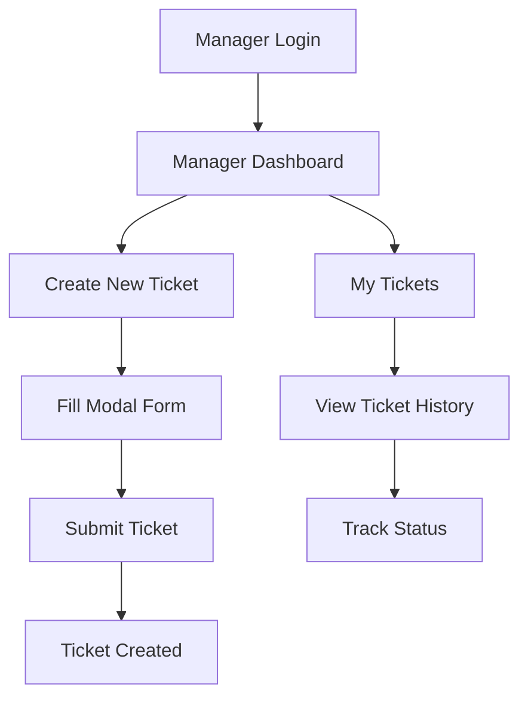

# Manager Ticket Access - Complete Flow Explanation

## 🎯 **How Managers Access & Create Tickets**

The manager ticket system provides **two main access points** for different ticket operations:

## 📝 **1. CREATING TICKETS - Manager Dashboard**

### **Access Path:**
```
Login → Manager Dashboard → "Create New Ticket" Button
```

### **User Interface:**
- **Location**: Manager Dashboard (`/manager/dashboard`)
- **Trigger**: Blue "Create New Ticket" button in top-right corner
- **Method**: Modal popup overlay

### **Creation Process:**
1. **Button Click**: "Create New Ticket" opens modal
2. **Form Fields**:
   - **Worker/Phone**: Dropdown of phones assigned to workers in manager's sectors
   - **Issue Title**: Text input (required)
   - **Priority**: Dropdown (Low, Medium, High, Urgent)
   - **Full Description**: Textarea (required)
3. **Submit**: POST to `/api/tickets` endpoint
4. **Validation**: Server-side validation of all fields
5. **Success**: Toast notification + modal closes + dashboard refreshes

### **Security Controls:**
- ✅ **Role Required**: Only managers can access
- ✅ **Sector Validation**: Can only create tickets for phones in their managed sectors
- ✅ **Session Verification**: Manager ID extracted from session
- ✅ **Input Validation**: All fields validated server-side

## 📋 **2. VIEWING TICKETS - My Tickets Page**

### **Access Path:**
```
Login → Manager Dashboard → "My Tickets" (sidebar) → Ticket History
```

### **User Interface:**
- **Location**: Dedicated page (`/manager/tickets`)
- **Navigation**: Sidebar link "My Tickets"
- **Display**: Responsive table with full ticket details

### **Viewing Process:**
1. **Navigation**: Click "My Tickets" in manager sidebar
2. **API Call**: GET to `/api/manager/tickets`
3. **Data Display**: Table with columns:
   - **ID**: Ticket number (e.g., #123)
   - **Priority**: Color-coded badges (Red/Amber/Blue/Gray)
   - **Title**: Issue description
   - **Worker**: Assigned worker name
   - **Phone Asset**: Phone asset tag
   - **Status**: Status badges (Open, In Progress, Resolved, Closed)
   - **Date Created**: YYYY-MM-DD format

### **Security Controls:**
- ✅ **Filtered Results**: Only shows tickets created by current manager
- ✅ **Role Protection**: Manager role required
- ✅ **Data Isolation**: Cannot see other managers' tickets

## 🔄 **Complete Ticket Workflow**

### **For Managers:**


## 🎨 **User Experience Features**

### **Dashboard Integration:**
- **Seamless Modal**: No page reload for ticket creation
- **Dynamic Form**: Phone dropdown populated with manager's sector workers
- **Real-time Feedback**: Toast notifications for success/error
- **Auto-refresh**: Dashboard updates after ticket creation

### **My Tickets Page:**
- **Consistent Navigation**: Same sidebar across manager portal
- **Visual Indicators**: Priority colors and status badges
- **Responsive Design**: Works on desktop and mobile
- **Empty State**: Friendly message when no tickets exist

## 🔧 **Technical Implementation**

### **Frontend (Manager Dashboard):**
```javascript
// Modal-based ticket creation
createTicketBtn.addEventListener('click', () => {
    populateTicketForm();     // Load available phones
    openTicketModal();        // Show modal
});

// Form submission
ticketForm.addEventListener('submit', async (e) => {
    // POST to /api/tickets
    // Handle success/error
    // Close modal and refresh
});
```

### **Backend API Endpoints:**
```python
# Ticket Creation
@app.route('/api/tickets', methods=['POST'])
@role_required('Manager')
def create_ticket():
    # Validate input
    # Check sector permissions
    # Insert ticket record
    # Return success/error

# Ticket Viewing
@app.route('/api/manager/tickets', methods=['GET'])
@role_required('Manager')
def get_manager_tickets():
    # Get manager ID from session
    # Query tickets by manager
    # Return filtered results
```

## 📊 **Data Flow Summary**

### **Creating Tickets:**
1. **Manager** clicks "Create New Ticket"
2. **System** loads phones from manager's sectors
3. **Manager** fills form and submits
4. **API** validates and stores ticket
5. **Database** records ticket with manager_id reference
6. **UI** shows success notification

### **Viewing Tickets:**
1. **Manager** navigates to "My Tickets"
2. **API** queries tickets WHERE reported_by_manager_id = current_user
3. **System** joins with phones/workers for display data
4. **UI** renders table with formatted data

## 🎯 **Key Benefits**

- **🔒 Secure**: Role-based access with data isolation
- **🎨 User-Friendly**: Modal creation + dedicated viewing page
- **📱 Responsive**: Works on all device sizes
- **⚡ Fast**: AJAX calls with no page reloads
- **🔍 Comprehensive**: Full ticket lifecycle visibility
- **🎭 Professional**: Consistent UI with priority/status indicators

Managers have **complete ticket management** capabilities with secure, intuitive access to both creation and viewing functionality!
